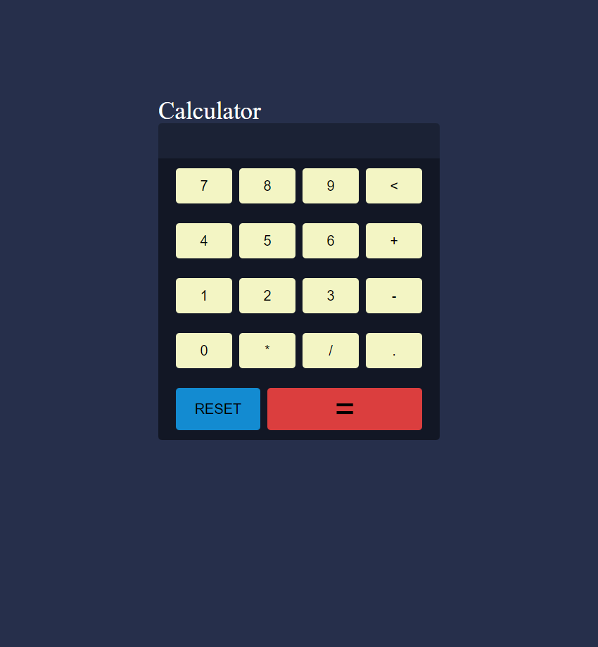

# Calculadora 

**Esse projeto de uma calculadora, feita em JS em que a função de todas as operações matemáticas!**
Quando comecei esse projeto, tinha ideia de que o JS poderia ser bem difícil, mesmo assim percebi que era até bem simples, se baseando apenas numa função onClick para cada tecla da calculadora de base, e assim diferenciava somente para cada uma as teclas de: reset, back, e obviamente a de calcular, "=".

## Código JS:

```jsx
// Função que insere o número a partir da função onclick;
function insert(num){
    let number = document.getElementById("calc").innerHTML;
    document.getElementById("calc").innerHTML = number + num
};
// Função de limpar, (reset);
function clean(){
    document.getElementById("calc").innerHTML = "";
};
//Função de apagar algarismo por algarismo;
function back(){
    let result = document.getElementById("calc").innerHTML;
    document.getElementById("calc").innerHTML = result.substring(0, result.length -1)
};
// Função padrão de JS para calcular com oque tem no input de algarismo;
function calc(){
    let result = document.getElementById("calc").innerHTML;
    if(result){
        document.getElementById("calc").innerHTML = eval(result)
    };
};
```
## Resultado final:


# 